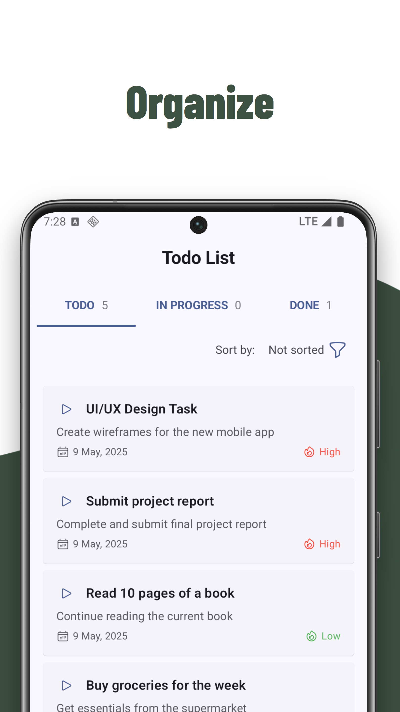
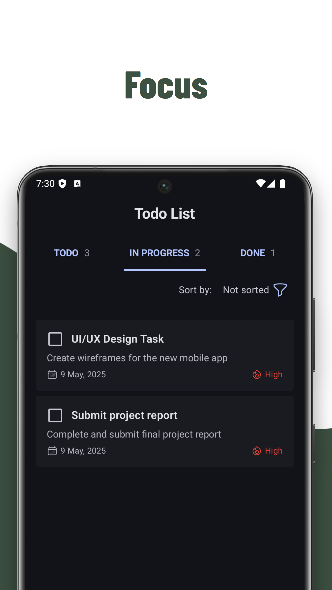
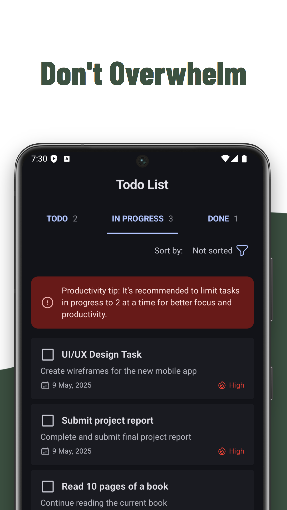
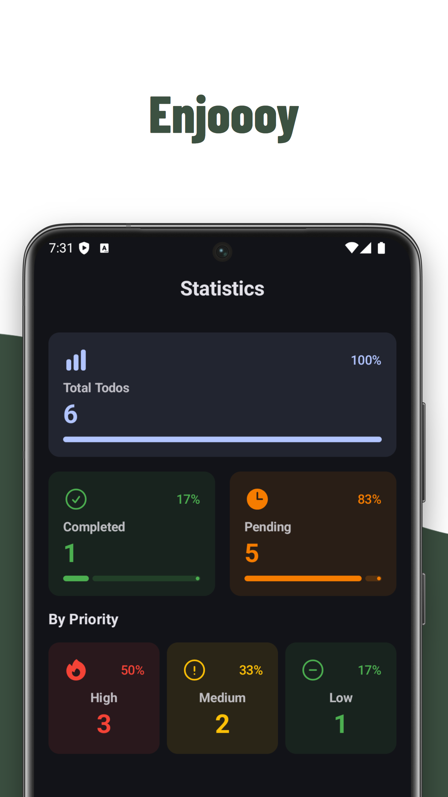
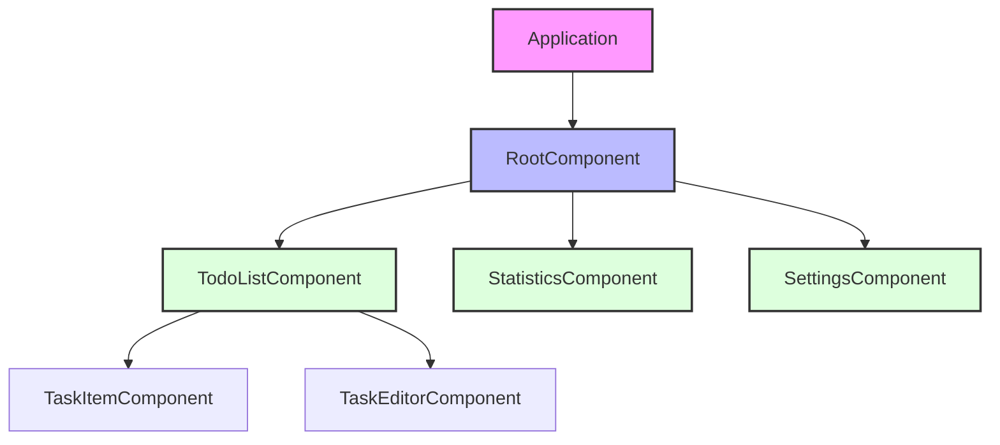
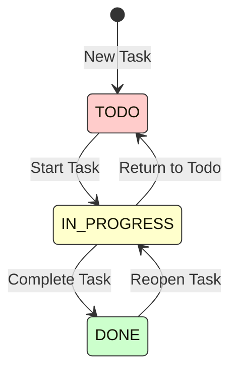
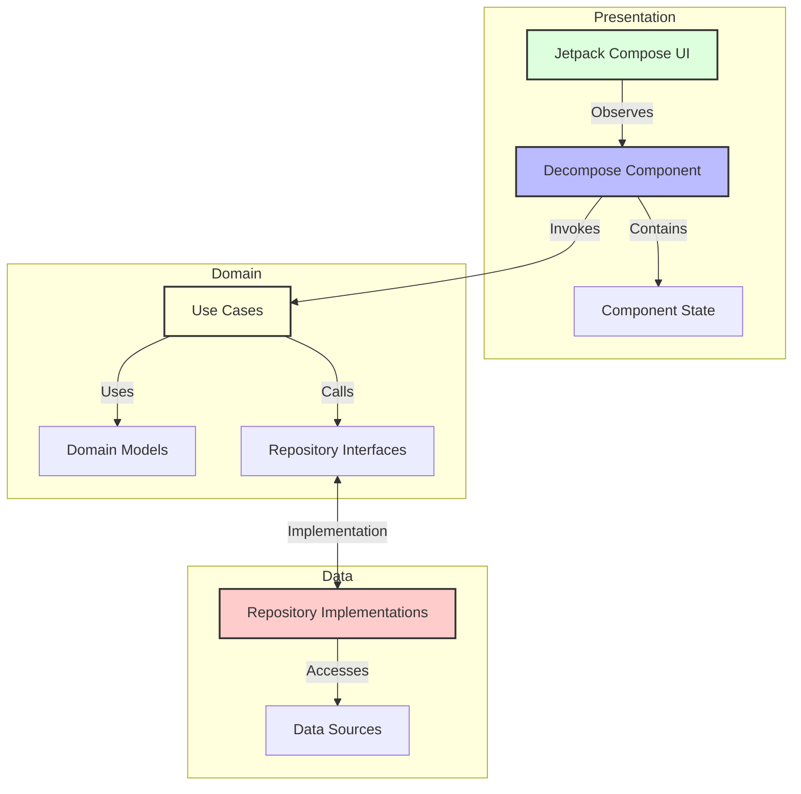

# Decompose Tutorial

  
  
  
  

  <em>Decompose helps you build applications that are organized, focused, not overwhelming, and enjoyable to develop.</em>

A comprehensive tutorial project showcasing **Decompose** for building reactive, component-based architectures in Kotlin Android development. This project demonstrates how to create modular, maintainable, and testable applications with proper separation of concerns.

  

## 📱 App Overview

This Todo app demonstrates Decompose's capabilities to manage component lifecycles, state, and navigation in a clean, predictable way. It follows reactive programming principles and showcases proper separation of concerns.

The app allows users to:
- Create and manage tasks with different priorities
- Track task progress through multiple states
- View statistics about task completion
- Customize the app appearance

## ✨ Key Features

- **Component-Based Architecture**: Independent UI components with their own lifecycle
- **Predictable State Management**: Immutable state and unidirectional data flow
- **Type-Safe Navigation**: No more fragment transactions or intent flags
- **Multi-Module Support**: Clean separation between features and layers
- **Composable-Friendly Design**: Natural integration with Jetpack Compose
- **Workflow Management**: Task state progression from Todo → In Progress → Done

## 📋 Task Workflow Management

The app demonstrates a clear task progression workflow with different states:

  <h3>Todo → In Progress → Done</h3>

  
  
  

The app provides smart workflow features:
- **Contextual tips** for better productivity
- **Visual indicators** for task status
- **Priority levels** shown with color coding
- **Deadline tracking** for time-sensitive tasks

## 🛠️ Task Management Features

  <table>
    <tr>
      <td align="center"></td>
      <td align="center"></td>
    </tr>
    <tr>
      <td align="center"><b>Create New Tasks</b> Add titles, descriptions, tags, deadlines, and priorities</td>
      <td align="center"><b>Task Details</b> View complete information and manage task status</td>
    </tr>
  </table>

## 📊 Statistics and Customization

  <table>
    <tr>
      <td align="center"></td>
      <td align="center"></td>
    </tr>
    <tr>
      <td align="center"><b>Productivity Stats</b> Track completion rates and task distribution</td>
      <td align="center"><b>App Settings</b> Customize theme and app preferences</td>
    </tr>
  </table>

## 🖥️ Dark Mode Support

  
  

## 🧩 Technical Architecture

This application demonstrates Decompose's powerful capabilities for component-based architecture:

### Core Architecture

### Task Workflow State Management

### Decompose Integration with Clean Architecture

## 📚 Additional Resources

- [Decompose Documentation](https://arkivanov.github.io/Decompose/)
- [Sample Code Repository](https://github.com/arkivanov/Decompose-samples)
- [Component-Based Architecture Guide](https://arkivanov.github.io/Decompose/component/overview/)

## 🔧 Setup and Installation

1. Clone the repository
2. Open in Android Studio Iguana or later
3. Build and run on your device or emulator

## 📝 License

This project is licensed under the MIT License - see the LICENSE file for details.
