# Decompose Tutorial

A comprehensive tutorial project showcasing **Decompose** for building reactive, component-based architectures in Kotlin Android development. This project demonstrates how to create modular, maintainable, and testable applications with proper separation of concerns.

  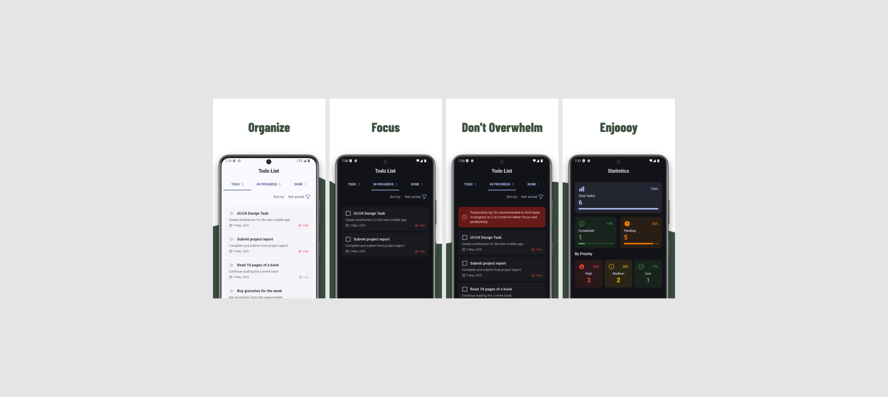

## 📱 App Overview

This Todo app demonstrates Decompose's capabilities to manage component lifecycles, state, and navigation in a clean, predictable way. It follows reactive programming principles and showcases proper separation of concerns.

The app allows users to:
- Create and manage tasks with different priorities
- Track task progress through multiple states
- View statistics about task completion
- Customize the app appearance

## ✨ Key Features

- **Component-Based Architecture**: Independent UI components with their own lifecycle
- **Predictable State Management**: Immutable state and unidirectional data flow
- **Type-Safe Navigation**: No more fragment transactions or intent flags
- **Multi-Module Support**: Clean separation between features and layers
- **Composable-Friendly Design**: Natural integration with Jetpack Compose
- **Workflow Management**: Task state progression from Todo → In Progress → Done

## 📋 Task Workflow Management

The app demonstrates a clear task progression workflow with different states:

  <h3>Todo → In Progress → Done</h3>

  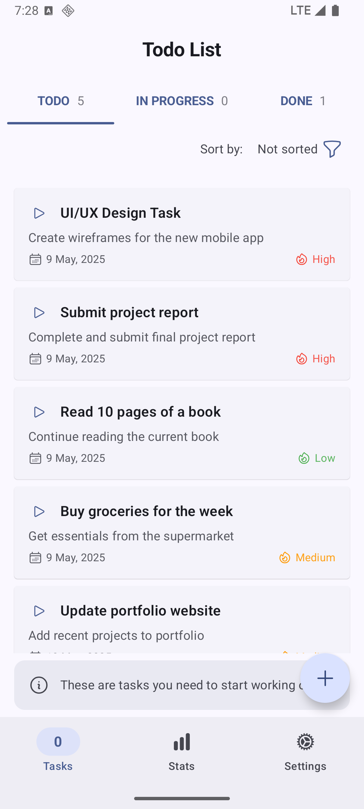
  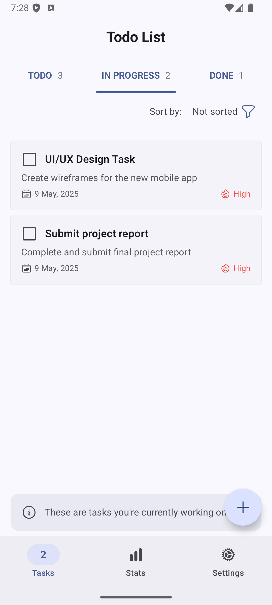
  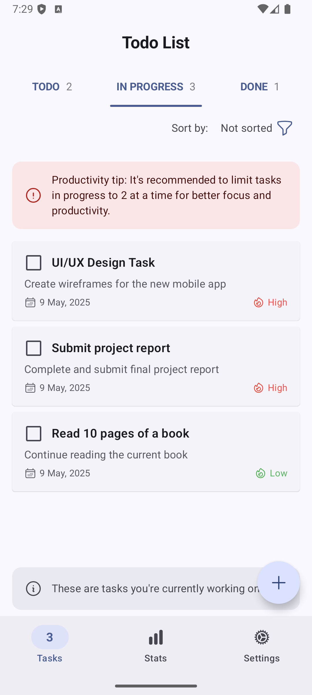

The app provides smart workflow features:
- **Contextual tips** for better productivity
- **Visual indicators** for task status
- **Priority levels** shown with color coding
- **Deadline tracking** for time-sensitive tasks

## 🛠️ Task Management Features

### Creating New Tasks

  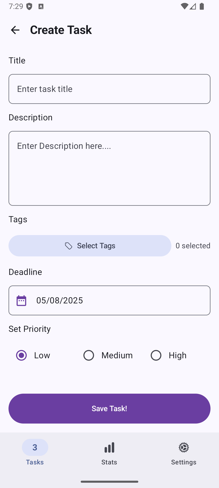
  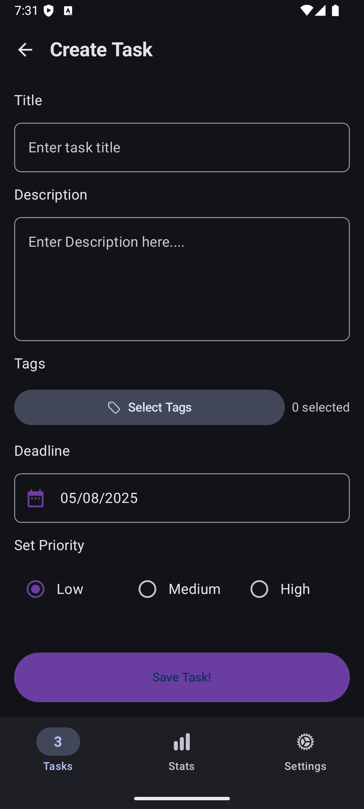

Task creation includes:
- Customizable titles and descriptions
- Tag selection for categorization
- Deadline setting with date picker
- Priority selection (Low/Medium/High)

### Task Details and Editing

  <table>
    <tr>
      <td align="center">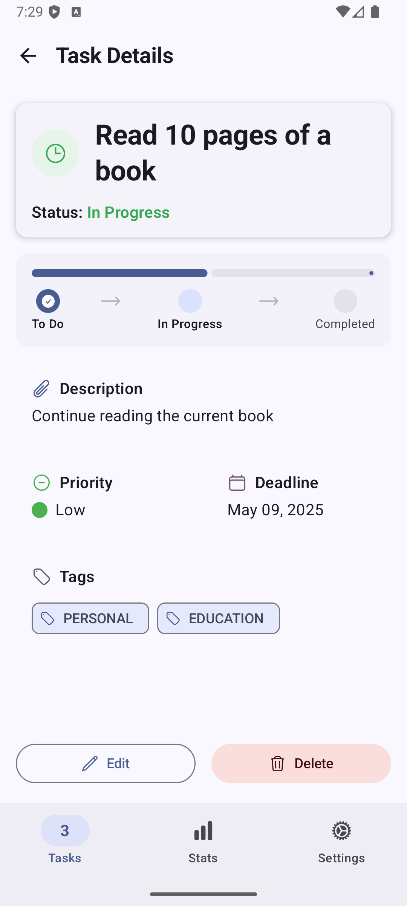</td>
      <td align="center">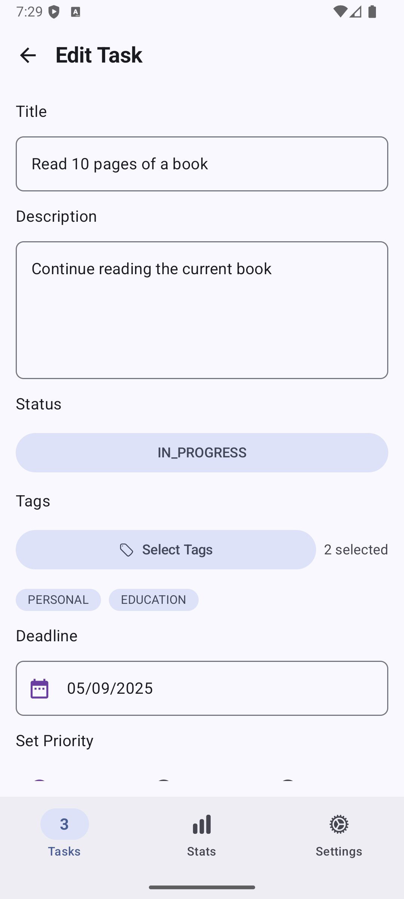</td>
    </tr>
    <tr>
      <td align="center"><b>Task Details</b></td>
      <td align="center"><b>Task Editing</b></td>
    </tr>
  </table>

The app supports:
- Detailed task information viewing
- Status transitions between workflow stages
- Tag and metadata editing
- Priority level adjustments

### Multiple Task Views

  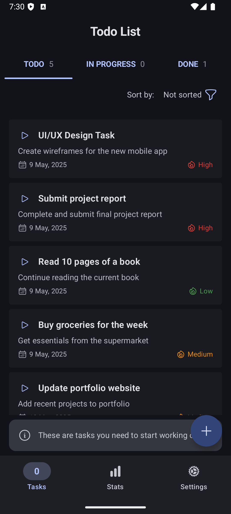
  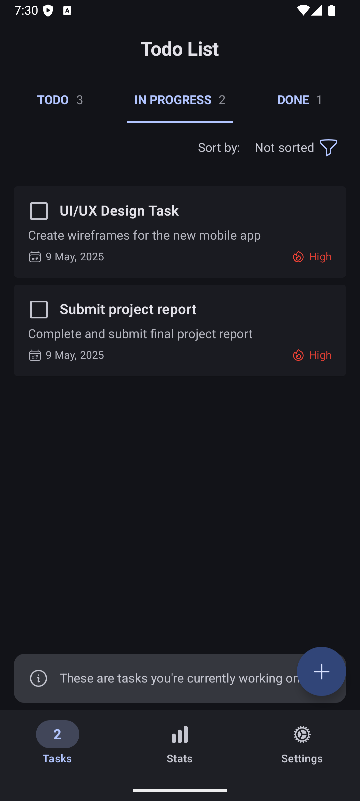
  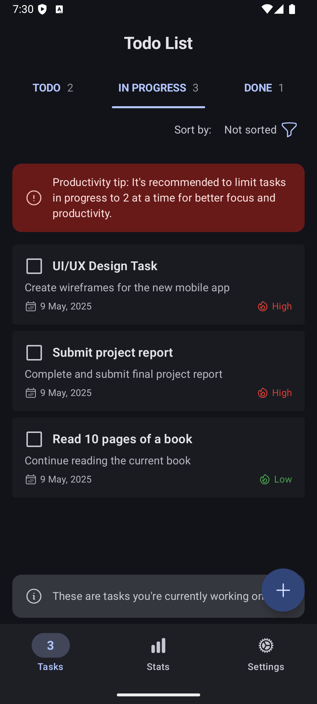

Task organization features:
- Grouped by current status
- Sorting options for different views
- Clear visual separation between states
- Intuitive transitions between states

## 📊 Statistics and Insights

Track your productivity with comprehensive statistics:

  <table>
    <tr>
      <td align="center">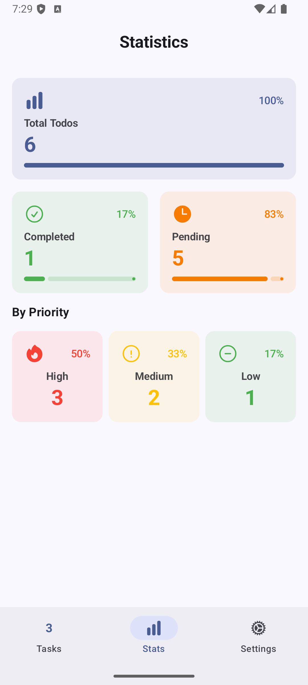</td>
      <td align="center">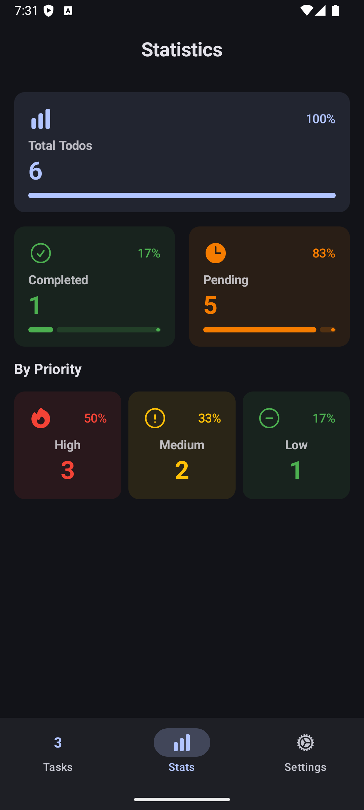</td>
    </tr>
    <tr>
      <td align="center"><b>Light Mode Statistics</b></td>
      <td align="center"><b>Dark Mode Statistics</b></td>
    </tr>
  </table>

The statistics dashboard provides insights on:
- **Total task count** with visual distribution
- **Completion rates** shown as percentage
- **Task distribution by priority** (High/Medium/Low)
- **Progress tracking** across workflow stages

## ⚙️ Settings and Customization

Personalize your experience with various settings:

  
  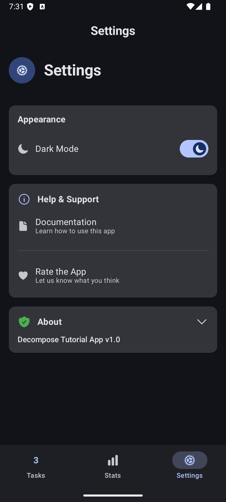

Customization options include:
- **Theme switching** between light and dark modes
- **Documentation access** for app usage help
- **Feedback mechanism** for app rating
- **Version information** and release details

## 🖥️ Dark Mode Support

The app offers a complete dark mode experience across all screens:

  <table>
    <tr>
      <td align="center">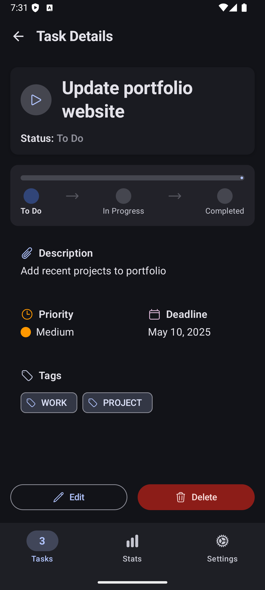</td>
      <td align="center">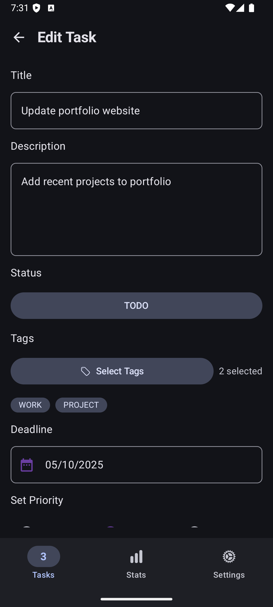</td>
    </tr>
    <tr>
      <td align="center"><b>Task Details</b></td>
      <td align="center"><b>Task Editing</b></td>
    </tr>
  </table>

Dark mode provides:
- Reduced eye strain in low-light environments
- Battery savings on OLED screens
- Consistent visual styling throughout the app
- Automatic adaptation to system settings

## 🧩 Technical Architecture

This application demonstrates:

1. **Component Hierarchy**: Root → Screen → Child Components
2. **State Management**: Each component has its own StateKeeper
3. **Navigation**: Type-safe navigation using Decompose
4. **Dependency Injection**: Clean provision of dependencies to components
5. **SaveInstanceState**: Automatic state restoration across configuration changes

## 📚 Additional Resources

- [Decompose Documentation](https://arkivanov.github.io/Decompose/)
- [Sample Code Repository](https://github.com/arkivanov/Decompose-samples)
- [Component-Based Architecture Guide](https://arkivanov.github.io/Decompose/component/overview/)

## 🔧 Setup and Installation

1. Clone the repository
2. Open in Android Studio Iguana or later
3. Build and run on your device or emulator

## 📝 License

This project is licensed under the MIT License - see the LICENSE file for details.
