# Decompose Tutorial


A comprehensive tutorial project showcasing **Decompose** for building reactive, component-based architectures in Kotlin Android development. This project demonstrates how to create modular, maintainable, and testable applications with proper separation of concerns.

## 🚀 Overview

Decompose provides powerful tools for creating independent UI components with their own lifecycle, state management, and navigation capabilities. This tutorial walks through implementing a Todo application with clean architecture principles and Decompose integration.

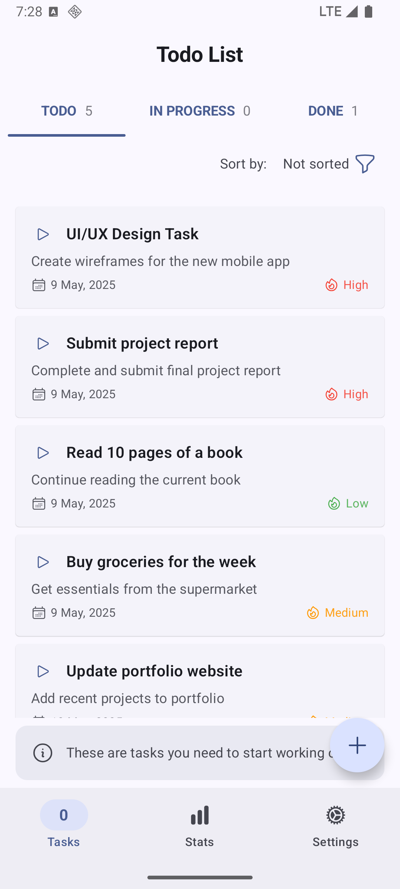

## ✨ Key Features

- **Component-Based Architecture**: Modular UI components with encapsulated logic
- **State Management**: Reactive state with unidirectional data flow
- **Type-Safe Navigation**: Navigation between components without Fragments
- **Back Stack Management**: Support for navigation history
- **Lifecycle Management**: Clean component lifecycle handling

## 📱 Screenshot Gallery

Below is a comprehensive table of all screenshots demonstrating different aspects of the application:

| Category | Screenshot | Description | Key Concepts |
|----------|------------|-------------|-------------|
| **Overview** |  | Main app overview showing the Todo list interface | Root component visualization, Overall app layout |
| **Todo Management** | 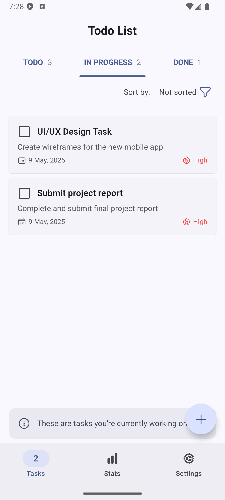 | Todo list displaying items in different stages | List component, Item rendering |
| | 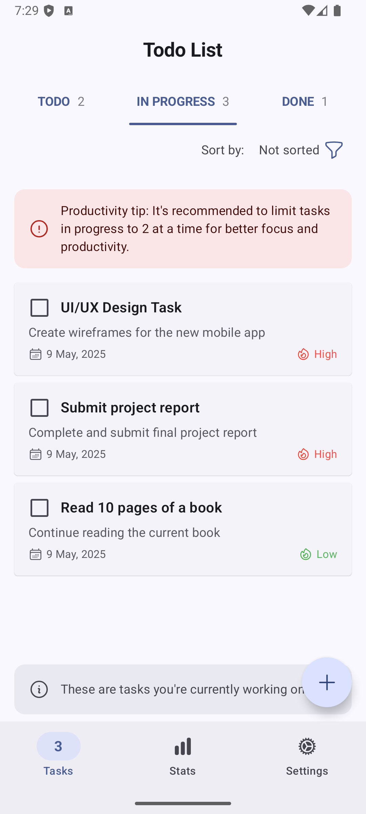 | Interface for creating a new Todo item | Form handling, User input |
| **Workflow Stages** | 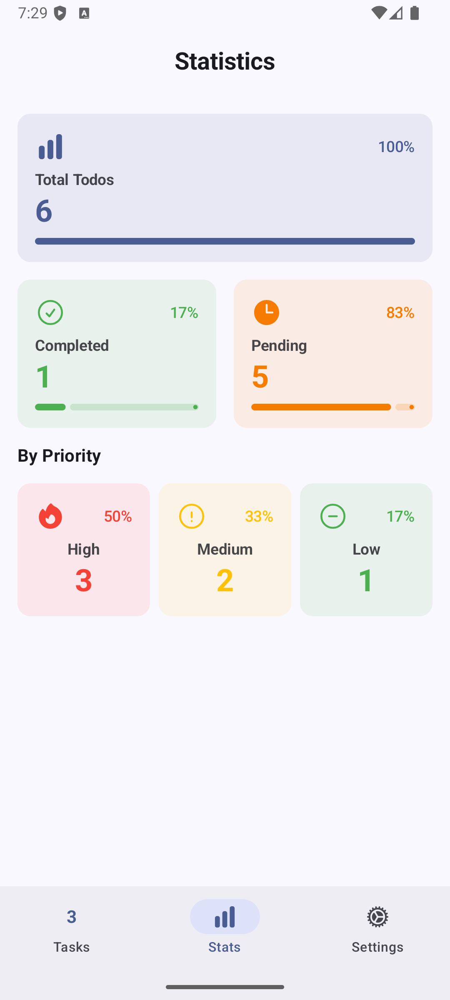 | Todo in initial stage with play button | State representation, Action buttons |
| | 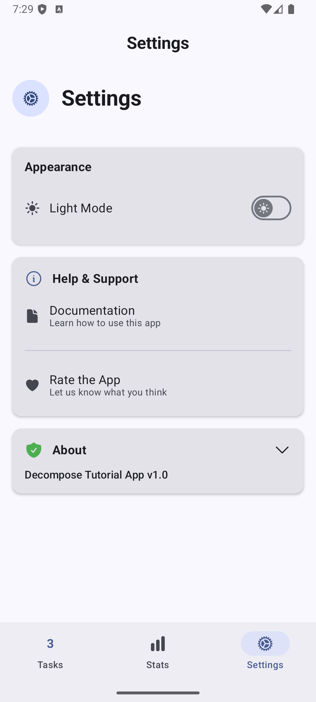 | Todo in "In Progress" stage | State transition, Progress tracking |
| | 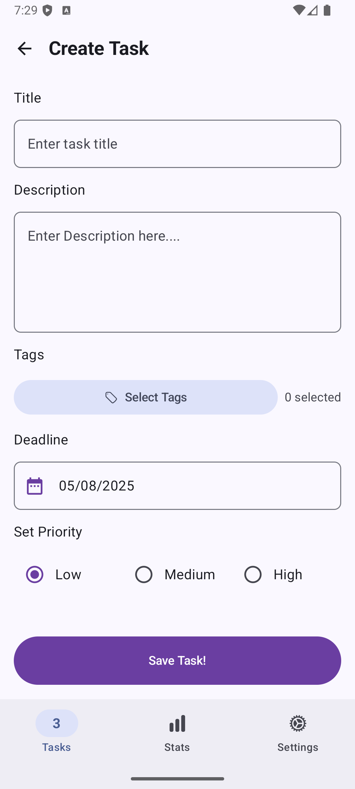 | Todo in "Done" stage with checked checkbox | Completion state, Visual feedback |
| **Item Details** | 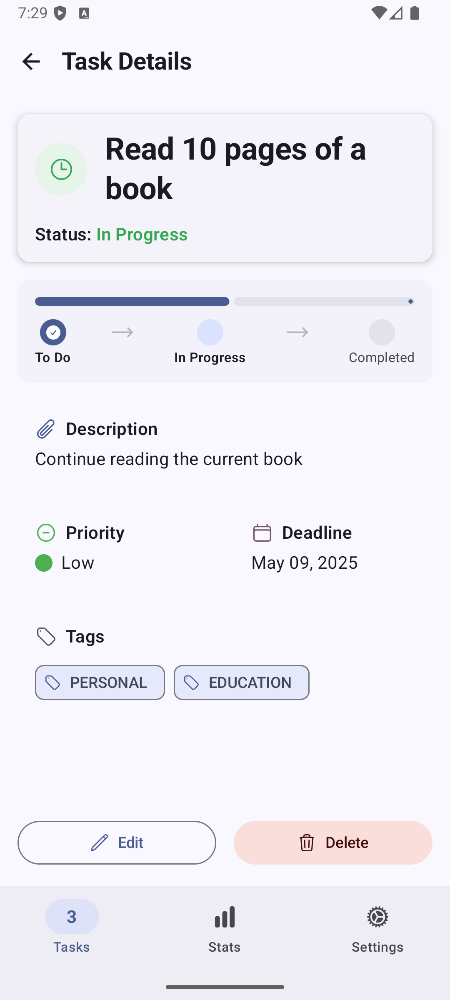 | Detailed view of a Todo item | Detail component, Information display |
| | 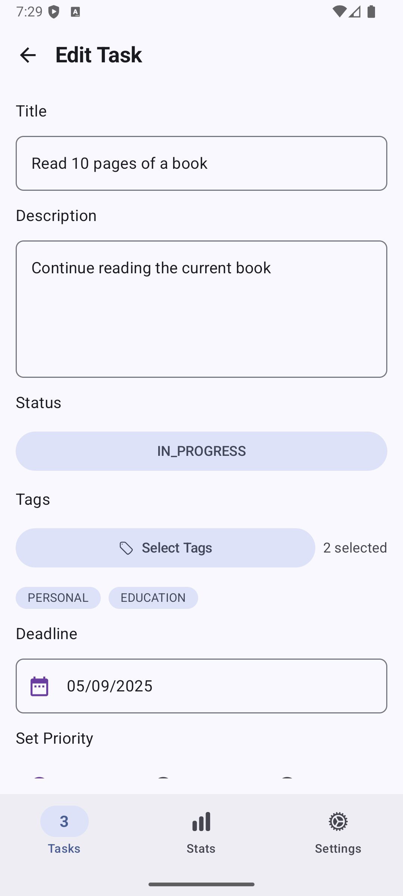 | Interface for editing a Todo item | Edit mode, Form validation |
| **Navigation** | 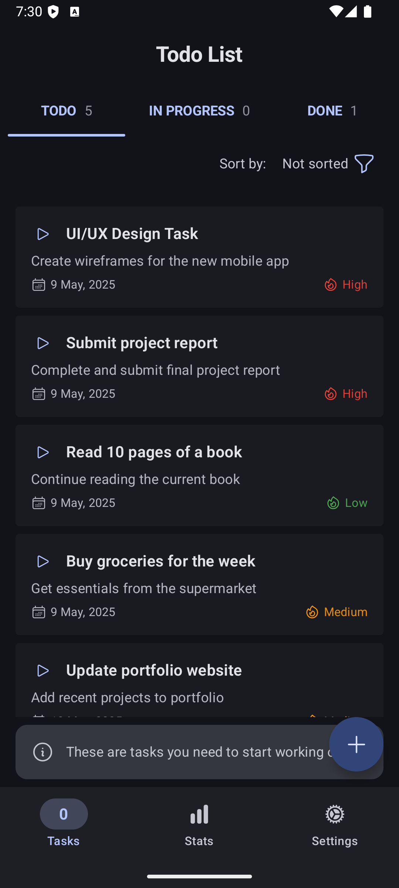 | Navigation between screens | Stack navigation, Component transition |
| | 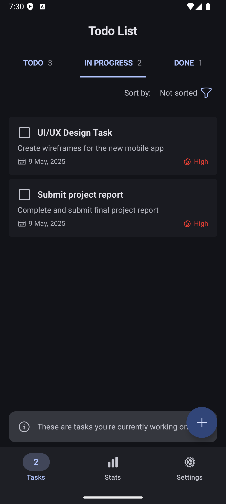 | Back navigation handling | Back stack, Component preservation |
| **Component Interaction** | 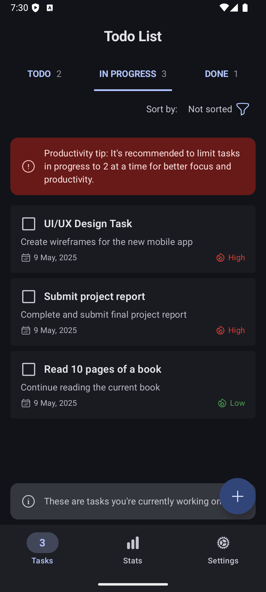 | Components communicating with each other | Event handling, Component communication |
| | 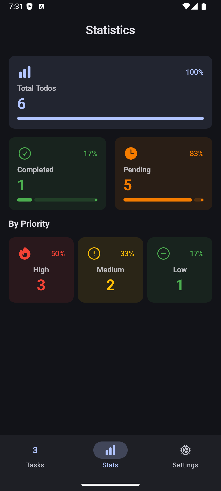 | State update between components | State propagation, Reactive updates |
| **Advanced Features** | 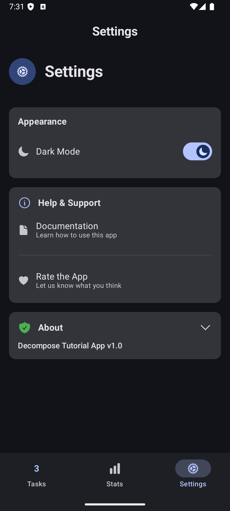 | Filtering and sorting capabilities | Filter component, State manipulation |
| | 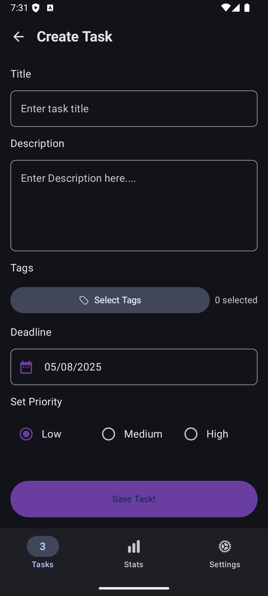 | Todo statistics and metrics | Analytics component, Data aggregation |
| |  | Settings and configuration options | Preferences component, User customization |
| | 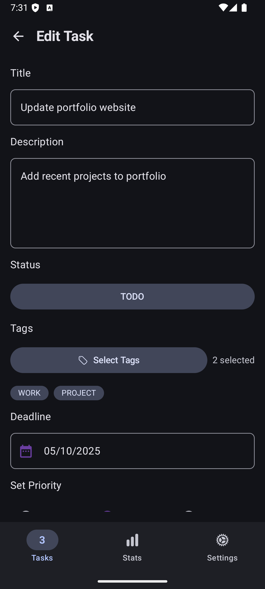 | Theme switching and appearance options | Theme component, Visual customization |

### Visual Tour of Todo States

The following sequence illustrates the lifecycle of a Todo item as it progresses through different states:

<p align="center">
  
  
  
</p>

1. **Todo Stage**: Initial state with play button to begin task
2. **In Progress Stage**: Active task with unchecked checkbox
3. **Done Stage**: Completed task with checked checkbox

## 🏗️ Architecture

This project follows Clean Architecture principles with a feature-based package structure combined with Decompose component architecture. This approach allows for better separation of concerns, high cohesion, and easier maintainability.

### Component Architecture

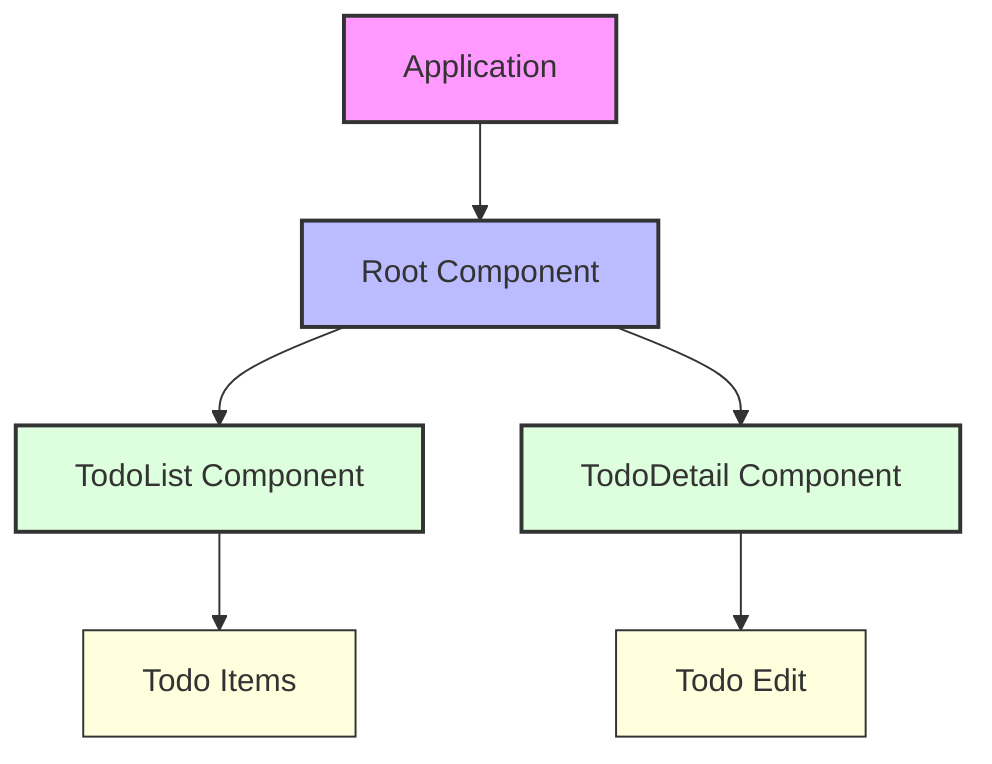

### Clean Architecture Layers

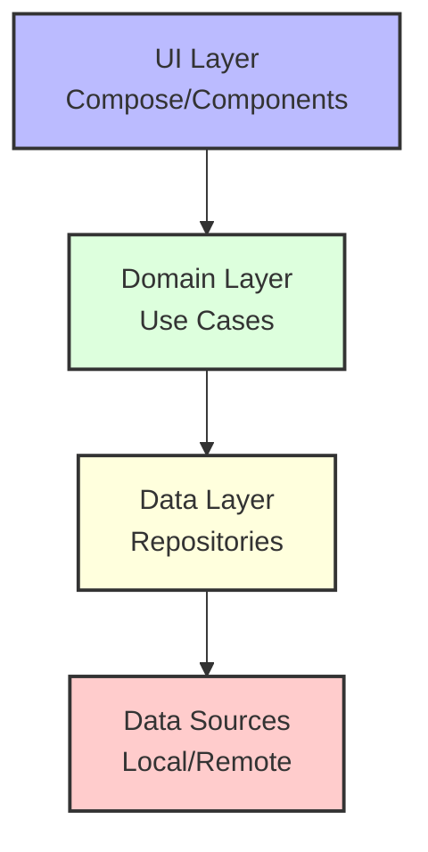

### Package Structure

```
app/src/main/java/dev/abd3lraouf/learn/decompose/
├── core/                   # Shared core components
│   ├── data/               # Data layer implementations
│   │   └── repository/     # Repository implementations
│   ├── di/                 # Dependency injection
│   ├── domain/             # Domain layer (business logic)
│   │   ├── model/          # Domain models
│   │   └── repository/     # Repository interfaces
│   └── presentation/       # Shared UI components
├── features/               # Feature modules
│   ├── todo/               # Todo feature
│   │   ├── data/           # Todo data layer
│   │   ├── domain/         # Todo domain layer
│   │   │   └── usecase/    # Todo use cases
│   │   └── presentation/   # Todo UI components
│   │       ├── create/     # Todo creation
│   │       ├── details/    # Todo details
│   │       └── list/       # Todo list
│   ├── statistics/         # Statistics feature
│   │   ├── data/           # Statistics data layer
│   │   ├── domain/         # Statistics domain layer
│   │   │   ├── model/      # Statistics models
│   │   │   └── usecase/    # Statistics use cases
│   │   └── presentation/   # Statistics UI components
│   └── settings/           # Settings feature
│       ├── data/           # Settings data layer
│       ├── domain/         # Settings domain layer
│       │   └── model/      # Settings models
│       └── presentation/   # Settings UI components
├── navigation/             # Navigation components
└── ui/                     # UI components and themes
```

### Architecture Layers

1. **Domain Layer**:
   - Contains business logic and domain models
   - Defines repository interfaces
   - Contains use cases that orchestrate data flow between repositories and UI

2. **Data Layer**:
   - Implements repository interfaces from the domain layer
   - Manages data sources (local, remote, memory)

3. **Presentation Layer**:
   - Contains UI components built with Jetpack Compose
   - Implements Decompose components for UI logic
   - Follows the MVU (Model-View-Update) pattern with Decompose

## 🧭 Navigation with Decompose

Decompose handles navigation through a component hierarchy:

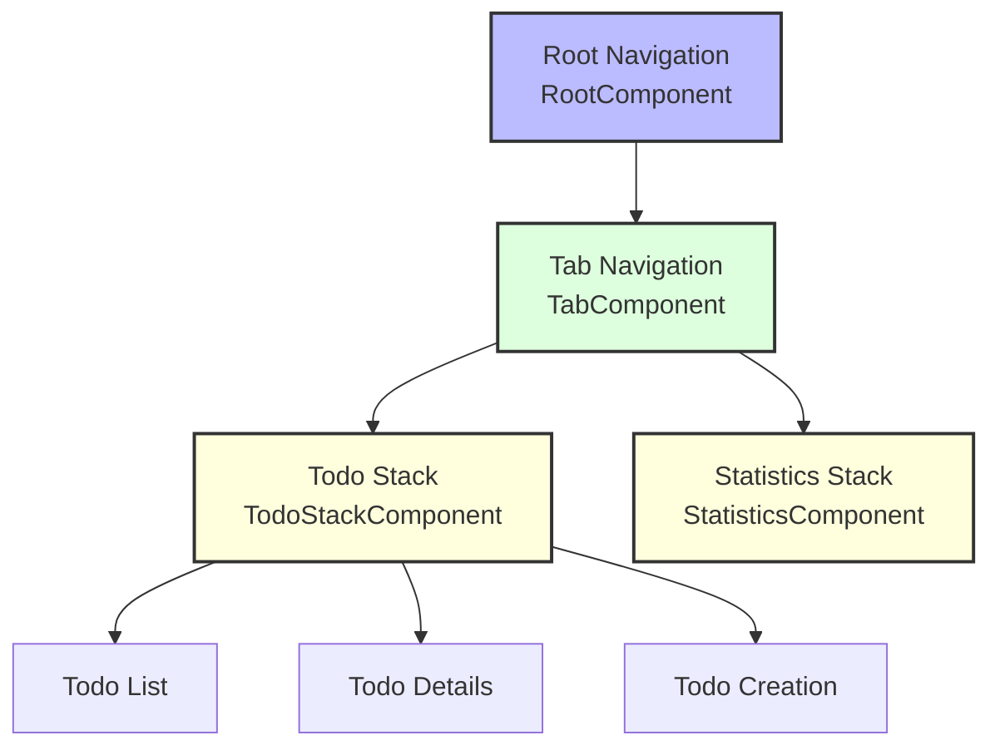

## 📋 Todo App Implementation

This tutorial implements a Todo application with a three-stage workflow:

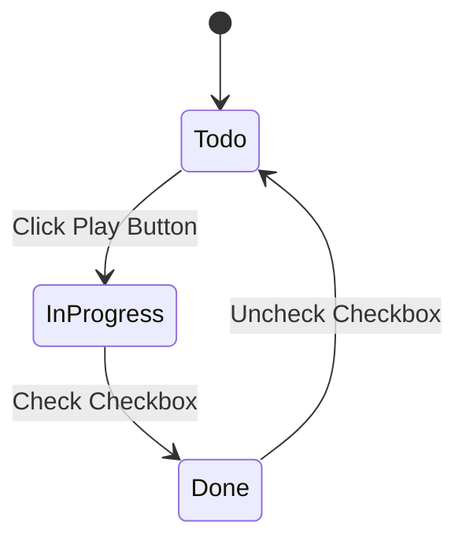

### Stage Implementation 

1. **Todo Stage**:
   - Display: Play button (no checkbox)
   - Action: Clicking play button moves todo to "In Progress" stage

2. **In Progress Stage**:
   - Display: Checkbox
   - Action: Checking the box moves todo to "Done" stage

3. **Done Stage**:
   - Display: Checkbox (checked)
   - Action: Unchecking the box moves todo back to "Todo" stage

## 💻 Component Implementation

A simple Decompose component looks like:

```kotlin
interface TodoListComponent {
    val models: Value<Model>
    
    fun onTodoClicked(id: String)
    fun onAddTodoClicked()
    
    data class Model(
        val todos: List<TodoItem>,
        val isLoading: Boolean
    )
}

class DefaultTodoListComponent(
    private val todoRepository: TodoRepository,
    private val componentContext: ComponentContext,
    private val onTodoSelected: (String) -> Unit,
    private val onAddTodo: () -> Unit
) : TodoListComponent, ComponentContext by componentContext {
    // Implementation
}
```

## 🛠️ Setup Instructions

1. Clone the repository
   ```bash
   git clone https://github.com/abd3lraouf/decompose-tutorial.git
   ```
   
2. Open the project in Android Studio

3. Build and run the app on a device or emulator

## 📚 Technologies

- **Kotlin**: Modern programming language
- **Jetpack Compose**: UI toolkit
- **Decompose**: Component architecture
- **Kotlin Coroutines**: Asynchronous programming
- **Koin**: Dependency injection

## 🧪 Testing

Decompose's component-based architecture makes testing more straightforward:

```kotlin
@Test
fun `when todo is clicked, it navigates to details screen`() {
    // Create test component
    val component = DefaultTodoListComponent(
        mockRepository,
        TestComponentContext(),
        onTodoSelected = { selectedId ->
            // Verify correct ID is passed
            assertEquals("todo-1", selectedId)
        },
        onAddTodo = {}
    )
    
    // Trigger action
    component.onTodoClicked("todo-1")
}
```

## 👨‍💻 About the Author

**Abdelraouf Sabri** - Senior Android Developer

- Website: [abd3lraouf.dev](https://abd3lraouf.dev)
- GitHub: [@abd3lraouf](https://github.com/abd3lraouf)

---

⭐️ Star this repository if you find it helpful!
